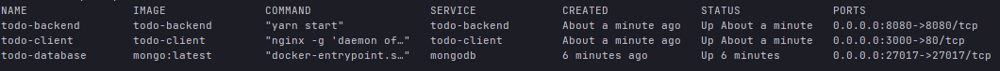

# MERN-Todo-App 
Todo List Application using MERN Stack (MongoDB, Express.js, React, Node.js) and bootstrap with Typescript React. The Application also uses password hashing and salting for the user accounts by using <a href="https://www.npmjs.com/package/bcryptjs">bcryptjs</a>. 


## Getting started

ℹ️ This Application runs on all common platforms: macOS, Windows 10/11, Linux (tested on Ubuntu 22.04 LTS)


### 🐋 Run Application with Docker (recommend)

⚠ Make sure you have Docker installed and running on your Machine. <a href="https://docs.docker.com/desktop/">Here you can find an Installation Link</a>

in the root directory of the project run 
```shell
docker-compose up -d --build
```

After the build process you can view the compose with
```shell
docker-compose ps
```
It should look similar to the following screenshot:


You can now open the Application with 
<a href="http://localhost:3000">**http://localhost:3000**</a>

<hr/>


